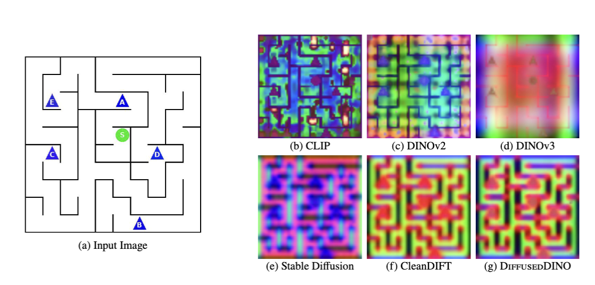
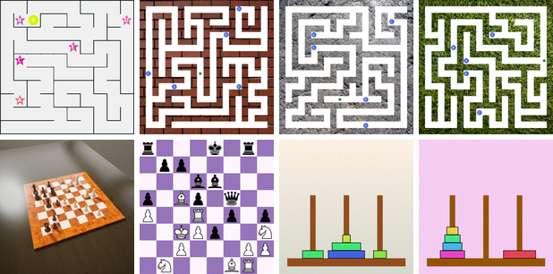

<h1 align="center">TDDN: Text-aligned Diffused DINO Network<br>for Puzzle Understanding</h1>

<p align="center">
  <a href="#">Harsha Patnala</a><sup>1,*</sup> &nbsp;·&nbsp;
  <a href="#">Debopriyo Banerjee</a><sup>2,*</sup> &nbsp;·&nbsp;
  <a href="#">Ayush Sunil Munot</a><sup>3</sup> &nbsp;·&nbsp;
  <a href="#">Somak Aditya</a><sup>3</sup>
</p>

<p align="center">
  <sup>1</sup>Eightfold AI &nbsp;&nbsp; <sup>2</sup>Inception42 &nbsp;&nbsp;
  <sup>3</sup>Indian Institute of Technology Kharagpur
  <br><sub><sup>*</sup>Equal contribution</sub>
</p>

<p align="center">
  <a href="https://harsha963.github.io/TDDN/">
    </a>
  <a href="#">
    </a>
  <a href="https://huggingface.co/datasets/PuzzleBench/Puzzle_Perception">
    </a>
  <a href="https://huggingface.co/PuzzleBench/TDDN">
    </a>
  
</p>

<p align="center">
  
  <br><sub>Patch features projected onto their top three principal components. CLIP produces fragmented,
  spatially inconsistent maps on structured images. DiffusedDINO keeps CleanDIFT's boundary precision
  while recovering DINOv3's object-level signal.</sub>
</p>

---

## Overview

Structured visual reasoning, like solving image puzzles, needs fine-grained visual perception — an
ability that CLIP-based VLM backbones largely lack, because their global contrastive objective trades
local spatial detail for high-level semantics. We recover it by fusing ViT (DINOv3) and Diffusion
(CleanDIFT) representations into a perception encoder, **DiffusedDINO**, then aligning it with a frozen
RoBERTa-L to produce **TDDN**.

TDDN matches CLIP on image–text retrieval while substantially surpassing it on dense prediction, using
frozen backbones and a fraction of the alignment data. We further show that the regions TDDN predicts
can steer a **frozen** VLM through Contrastive Region Guidance, improving its puzzle perception without
updating a single VLM weight. Alongside the model we release **Puzzle Perception**, a benchmark that
pairs pixel-level segmentation with puzzle-based visual question answering.

<p align="center">
  
  <br><sub><strong>TDDN architecture.</strong> Frozen CleanDIFT UNet and DINOv3 ViT-H/16+ feed a trainable fusion path; RoBERTa-L is frozen
  on the text side. Only the per-layer MLPs, the fusion MLP, the self-attention blocks and the text
  projection are trained.</sub>
</p>

## Results

Zero-shot open-vocabulary segmentation (mIoU) and keypoint matching (PCK@0.1):

| Model | ADE20K | Cityscapes | COCO-Stuff | PASCAL-Ctx | Puzzle | SPair-71k |
|:---|---:|---:|---:|---:|---:|---:|
| CLIP ViT-L/14 | 5.20 | 10.05 | 7.35 | 10.44 | 11.04 | 24.89 |
| TDN (ours) | 16.51 | 24.29 | 20.67 | 27.55 | 20.92 | 28.29 |
| **TDDN (ours)** | **18.11** | **32.38** | **24.44** | **32.48** | **22.51** | **32.39** |

Both of our models are trained on ~590K alignment pairs with every backbone frozen, against CLIP's 400M.
See the [paper](#) or the [project page](https://harsha963.github.io/TDDN/) for the full comparison
against SigLIP 2, MetaCLIP, OpenCLIP, DFN and FG-CLIP 2, plus retrieval, classification and CRG results.

## Models

| Paper | Tag | What it is |
|:---|:---|:---|
| DiffusedDINO | `fused-dinov3-cd` | Frozen DINOv3 ⊕ frozen CleanDIFT fusion. No training. |
| [TDN](https://huggingface.co/PuzzleBench/TDN) | `tdn` | Text-aligned DINOv3 (backbone `vith-roberta`). The no-fusion ablation. |
| [**TDDN**](https://huggingface.co/PuzzleBench/TDDN) | `tddn` | Text-aligned DiffusedDINO (backbone `fused-dinov3-cd`). The full model. |

Tags come in two layers: **backbone tags** live in
[`registry.py`](experiments/shared_utils/feature_extraction/registry.py) and name a feature extractor,
while **model tags** live in each experiment's `configs/models.yaml` and wire a backbone to an
evaluation. `tdn` and `tddn` are model tags; `fused-dinov3-cd` is a backbone tag.

<details>
<summary>Baseline tags</summary>

**Backbones** (`registry.py`): `dinov3-vitb16`, `dinov3-vith16plus`, `dinov2-vitb14`, `dinov2-vitl14`,
`dinov2-vitg14`, `clip-vitl14`, `clip-vitl14-336`, `sd`, `cleandift`, `vith-roberta`, `fused-dinov3-cd`

**Vision-language baselines** (`Vision_Language_Alignment/configs/models.yaml`): `clip`, `metaclip_l14`,
`dfn_l14`, `openclip_l14`, `siglip2_l16`, `fgclip2_large`

</details>

## Installation

One environment covers every experiment and dataset script.

```bash
python -m venv .venv && source .venv/bin/activate
pip install -r requirements.txt
pip install -e <path>/dinov3          # Meta AI DINOv3 reference impl
```

`dinov3` is not on PyPI. Either `pip install -e` it as above, or point `DINOV3_ROOT` at its source
tree and the loaders will add it to `sys.path` at runtime.

## Environment variables

| Variable | Required | Purpose |
|:---|:---:|:---|
| `HF_TOKEN` | **yes** | Gated DINOv3 and RoBERTa-large weights |
| `DINOV3_ROOT` | no | Path to the DINOv3 source tree, if not `pip install -e`'d |
| `EXPERIMENTS_DATASETS_ROOT` | no | Keep datasets outside the repo tree |
| `EXPERIMENTS_CHECKPOINTS_ROOT` | no | Keep checkpoints outside the repo tree |
| `EXPERIMENTS_FEATURES_ROOT` | no | Relocate the feature cache |
| `EXPERIMENTS_LOCAL_DATA_ROOT` | no | Relocate [`datasets/_local/`](datasets/_local/) |

Defaults for all four path overrides are resolved in
[`shared_utils/paths.py`](experiments/shared_utils/paths.py). Individual scripts also honour
`DATASET_ROOT`, `IMAGENET_HF_CACHE`, `CHESS_DATASET`, `ALIGNMENT_CKPT`, and the
legacy-only `ALIGNMENT_CKPT_STEPS`.

## Dataset — Puzzle Perception

Existing benchmarks cover only half of this problem: segmentation datasets give pixel-level annotations
but no question answering, while puzzle-reasoning datasets test reasoning without dense supervision.
Puzzle Perception pairs both across four structured domains — Maze, Chess, Tower of Hanoi and N-Queens —
rendered at 512×512 over 30 classes, with masks taken straight from the rendering pipeline so there is
no annotation noise. None of its images appear in the alignment corpus, so every result on it is
zero-shot transfer.

<p align="center">
  
  <br><sub>Maze varies wall texture while holding topology fixed, Chess mixes 2D and 3D renders, and
  Tower of Hanoi spans arrangements up to five disks per peg.</sub>
</p>

| Puzzle | Seg | PVQA | Classes | Train | Val | Test |
|:---|:---:|:---:|---:|---:|---:|---:|
| Maze | ✓ | ✗ | 8 | 2,000 | 500 | 500 |
| Chess | ✓ | ✓ | 15 | 2,000 | 500 | 500 |
| Tower of Hanoi | ✓ | ✗ | 7 | 2,000 | 500 | 500 |
| N-Queens | ✗ | ✓ | 2 | – | – | 100 |

```bash
python datasets/download_datasets.py --dataset puzzle_perception
```

Also on the Hub: [`PuzzleBench/Puzzle_Perception`](https://huggingface.co/datasets/PuzzleBench/Puzzle_Perception).

## Experiments

Six evaluation tracks, each self-contained under [`experiments/`](experiments/):

| Track | Tests | Headline metric | Paper |
|:---|:---|:---|:---:|
| [Representation_Analysis](experiments/Representation_Analysis/) | Intrinsic feature quality and cross-encoder similarity | CKA / PWCCA, uniformity / alignment | §5.1 |
| [Segmentation](experiments/Segmentation/) | Linear-probe dense prediction, frozen backbone | mIoU on Puzzle Perception | §5.1 |
| [Keypoint_Matching](experiments/Keypoint_Matching/) | Fine-grained spatial correspondence | PCK@0.1 on SPair-71K | §5.1–5.2 |
| [ImageNet_Classification](experiments/ImageNet_Classification/) | Global-feature semantic separability | k-NN top-1 (k=20) | §5.1 |
| [Vision_Language_Alignment](experiments/Vision_Language_Alignment/) | End-to-end alignment vs CLIP-lineage encoders | Open-vocab mIoU, R@1, top-1 | §5.2 |
| [CRG](experiments/CRG/) | Can TDDN's regions steer a frozen VLM at decode time? | Δ question accuracy | §5.3 |

Each track's README documents its own flags. Representative invocations:

```bash
# Representation analysis — plots, activation maps, metrics
python experiments/Representation_Analysis/run.py --help

# Train, then evaluate, a segmentation probe
python experiments/Segmentation/run_train.py
python experiments/Segmentation/run_eval.py

# Evaluate a single tag on a downstream task
python experiments/Keypoint_Matching/run_eval.py --model tddn
python experiments/ImageNet_Classification/run_eval.py --model tddn

# Vision-language alignment: train the heads, then evaluate
python experiments/Vision_Language_Alignment/run_train.py
python experiments/Vision_Language_Alignment/run_eval.py --model tddn

# Contrastive Region Guidance on a frozen VLM
python experiments/CRG/run_eval.py
```

## Training setup

TDN and TDDN share one alignment pipeline and differ only in the vision representation they consume.

| | |
|:---|:---|
| Input resolution | 336×336 (21×21 patch grid) |
| CleanDIFT layers | {2, 5, 8}, each projected to 512-d |
| Attention blocks | K = 2 per branch, RoPE |
| Trainable params | ~80M (all backbones frozen) |
| Objective | Symmetric InfoNCE + STRUCTURE regulariser |
| Schedule | 5,000 iterations, AdamW, cosine decay |
| Hardware | 4× A100 80GB (FSDP, bf16), ~15 hours |

## Citation

```bibtex

```

## Acknowledgements

Built on [DINOv3](https://github.com/facebookresearch/dinov3),
[CleanDIFT](https://github.com/CompVis/cleandift),
[RoBERTa](https://huggingface.co/FacebookAI/roberta-large), and
[Contrastive Region Guidance](https://github.com/uw-mad-dash/contrastive-region-guidance).
Alignment follows the low-data recipe of STRUCTURE. We thank the authors of all of the above for
releasing their code and weights.
