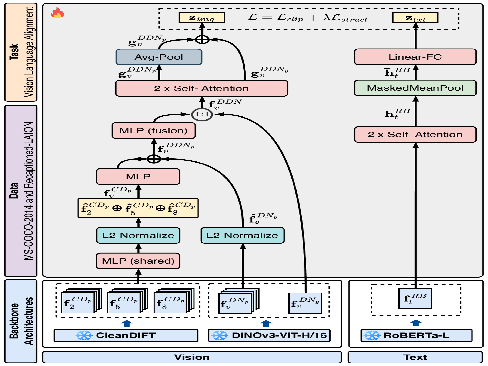
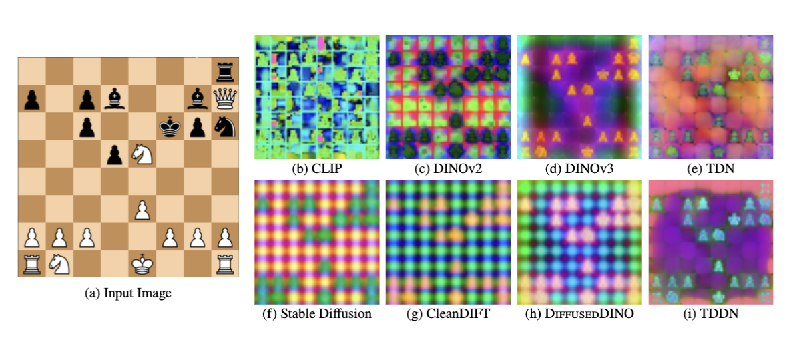

# TDDN: Text-aligned Diffused DINO Network

Structured visual reasoning, such as solving image puzzles, needs fine-grained
visual perception. TDDN combines the semantic organization of DINOv3 with the
spatial precision of CleanDIFT in **DiffusedDINO**, then aligns that visual
representation with a frozen RoBERTa-large text encoder. The result is a
text-aligned encoder designed to retain dense perceptual detail while providing
image–text representations for retrieval and open-vocabulary prediction. The
DINOv3-only counterpart is [**PuzzleBench/TDN**](https://huggingface.co/PuzzleBench/TDN).

With frozen backbones and approximately 590K image–caption alignment pairs,
TDDN matches CLIP on image–text retrieval while substantially improving dense
prediction. Its dense features can also provide regions for Contrastive Region
Guidance, allowing a frozen VLM to use spatial guidance for puzzle perception.

The release contains only trained alignment-head weights in
`model.safetensors`. The DINOv3, CleanDIFT, Stable Diffusion 2.1, and
RoBERTa backbones are fetched separately by the reference implementation;
users must have access to the upstream models.

## Architecture

<p align="center"></p>

The visual branch keeps both backbones frozen. DINOv3 ViT-H/16+ supplies its
semantic patch tokens and CLS token. CleanDIFT supplies noise-free,
fine-grained decoder activations from layers 2, 5, and 8. At the 336×336
reference resolution, these features are interpolated onto a shared 21×21
patch grid; each CleanDIFT layer is independently projected to 512 dimensions,
normalized, and concatenated before learned fusion with DINOv3 patch tokens.

Two trainable self-attention blocks with rotary position embeddings refine the
fused visual tokens. The final image representation concatenates the refined
global token with mean-pooled patch features, yielding a 2,560-dimensional
image embedding alongside dense patch features. On the text branch, frozen
RoBERTa-large tokens are refined by two trainable self-attention blocks,
masked-mean pooled, and linearly projected into the same joint space.



## Quick start

Install the [TDDN repository](https://github.com/adityaSomak/TDDN), its
requirements, and the DINOv3 reference package. Authenticate with Hugging Face
to access the gated DINOv3 backbone, then load TDDN directly:

```python
from shared_utils.feature_extraction import load_model

model, metadata = load_model("tddn", device="cuda")
```

The same API supports an explicitly downloaded local snapshot:

```python
model, metadata = load_model("tddn", device="cuda", checkpoint="/path/to/TDDN")
```

## Alignment design

Only the fusion and alignment heads are trained; DINOv3, CleanDIFT, and
RoBERTa-large remain frozen. Training uses approximately 590K MS COCO 2014
image–caption pairs with a symmetric InfoNCE objective and the STRUCTURE
regularizer. This regularizer anchors alignment to pretrained geometry while
the learned fusion path combines CleanDIFT's local boundary information with
DINOv3's global semantic structure. The complete training provenance is
provided in `training_config.yaml`.

## Evaluation

All results use frozen backbones. Segmentation is zero-shot open-vocabulary
segmentation (mIoU); SPair-71k is keypoint matching (PCK@0.1); retrieval is
recall at rank 1 (R@1).

### Segmentation (mIoU ↑)

TDDN outperforms CLIP and the DINOv3-only TDN variant on every segmentation
benchmark. The largest gains appear on Cityscapes, COCO-Stuff, and
PASCAL-Context, where CleanDIFT's local boundary detail complements DINOv3's
semantic structure. This is also reflected in the improvement on the
structured Puzzle Perception benchmark.

| Model | ADE20K | Cityscapes | COCO-Stuff | PASCAL-Ctx | Puzzle |
|---|---:|---:|---:|---:|---:|
| CLIP ViT-L/14 | 5.20 | 10.05 | 7.35 | 10.44 | 11.04 |
| TDN | 16.51 | 24.29 | 20.67 | 27.55 | 20.92 |
| TDDN | 18.11 | 32.38 | 24.44 | 32.48 | 22.51 |

### Keypoint matching (PCK@0.1 ↑)

TDDN obtains the best SPair-71k score, improving over both CLIP and TDN. The
result supports the architectural goal of combining DINOv3's semantically
organized patches with CleanDIFT's spatially precise correspondences.

| Model | SPair-71k |
|---|---:|
| CLIP ViT-L/14 | 24.89 |
| TDN | 28.29 |
| TDDN | 32.39 |

### Image–text retrieval (R@1 ↑)

TDDN remains competitive with CLIP despite the low-data alignment setting.
It exceeds CLIP on COCO image-to-text, COCO text-to-image, and Flickr30K
text-to-image retrieval, while CLIP remains strongest on Flickr30K
image-to-text retrieval. Relative to TDN, the fused model preserves similar
retrieval quality while delivering stronger dense perception.

| Model | Flickr30K I2T | Flickr30K T2I | MS-COCO-14 I2T | MS-COCO-14 T2I |
|---|---:|---:|---:|---:|
| CLIP ViT-L/14 | 87.7 | 66.96 | 34.60 | 18.53 |
| TDN | 85.8 | 72.88 | 37.1 | 24.1 |
| TDDN | 85.3 | 71.24 | 36.1 | 24.0 |
